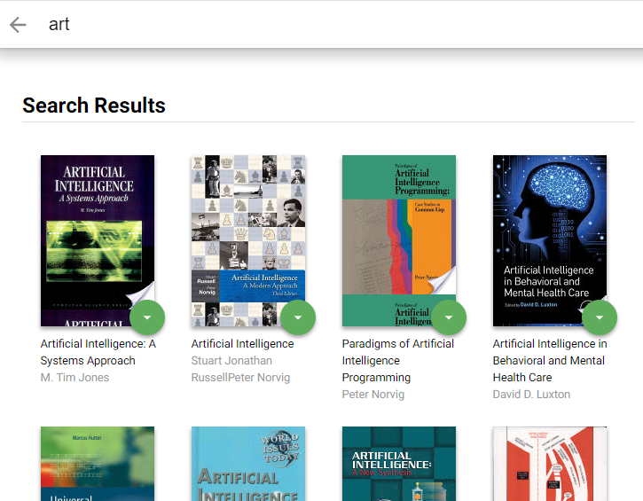
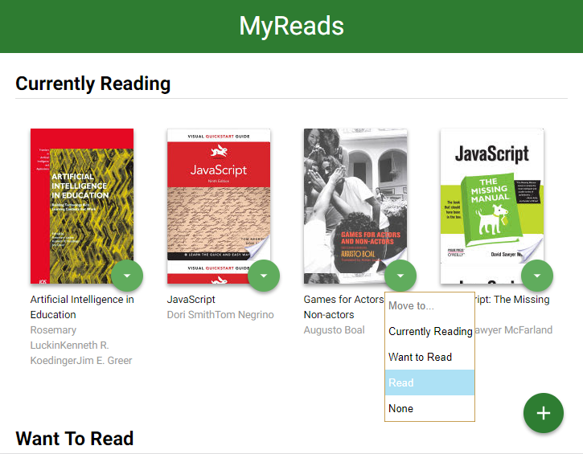

# MyReads App Project by Udacity

MyReads is a bookshelf app that allows the user to select and categorize books they have read, are currently reading, or want to read. This project emphasizes the use of React with a given API server. 

## How To Use
The main page shows a control that allows you to move books between shelves. The search page allows users to search for new books to add to their shelves. To access the search page select the plus icon located at the bottom right of the page. Type in the search field for possible books to be found. Once loaded you may choose which shelf to send a book to by clicking on the green circle with a down arrow of any book.

## Screenshot

## How To Install

* To run this file, download the GitHub zip file or clone the repository.
* Open the root folder of the repository in a terminal
* Get started by intalling npm, please follow this tutorial - http://blog.npmjs.org/post/85484771375/how-to-install-npm
* install all project dependencies with `npm install`
* start the development server with `npm start`

## Important
The backend API uses a fixed set of cached search results and is limited to a particular set of search terms, which can be found in [SEARCH_TERMS.md](SEARCH_TERMS.md). That list of terms are the _only_ terms that will work with the backend.

## Create React App

This project was bootstrapped with [Create React App](https://github.com/facebookincubator/create-react-app). You can find more information on how to perform common tasks [here](https://github.com/facebookincubator/create-react-app/blob/master/packages/react-scripts/template/README.md).

## Technologies Used

* HTML5
* CSS3
* JavaScript ES6
* React.js
